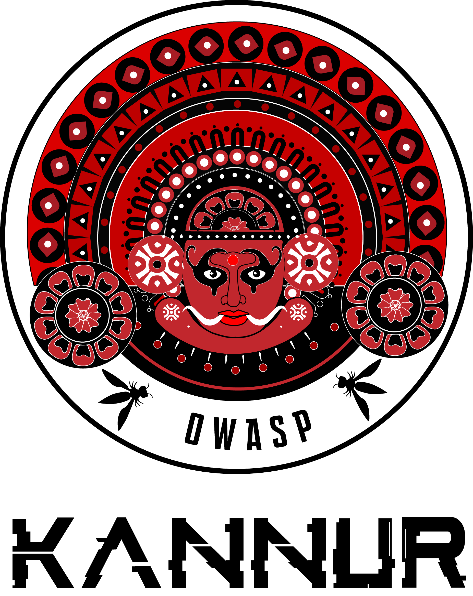

---

layout: col-sidebar
title: OWASP Kannur
tags: kannur
region: Asia
meetup-group: owasp-kannur
country: India
postal-code: 670001

---

## Welcome

### നമസ്കാരം
 
Welcome to the official OWASP Kannur Chapter! We are a chapter devoted to building a community that fosters collaboration and sharing knowledge on application security and cybersecurity.

We hope you can join and participate in our [meetups](https://www.meetup.com/owasp-kannur/){:target='_blank'} and [events](https://owasp.org/www-chapter-kannur/#div-events), and get plugged into OWASP Kannur  Meetup Group. If you would like to speak on our upcoming events goto [speakers](https://owasp.org/www-chapter-kannur/#div-speakers) section.

We would be delighted to see you soon!

## Participation

The Open Web Application Security Project (OWASP) is a nonprofit foundation that works to improve the security of software. All of our projects ,tools, documents, forums, and chapters are free and open to anyone interested in improving application security. 

Chapters are led by local leaders in accordance with the [Chapters Policy](/www-policy/operational/chapters). Financial contributions should only be made online using the authorized online donation button. To be a SPEAKER at ANY OWASP Chapter in the world simply review the [speaker agreement](/www-policy/legal/speaker-agreement) and then contact the local chapter leader with details of what OWASP Project, independent research, or related software security topic you would like to present.

Everyone is welcome and encouraged to participate in our [Projects](/projects/), [Local Chapters](/chapters/), [Events](/events/), [Online Groups](https://groups.google.com/a/owasp.com/){:target='_blank'}, and [Community Slack Channel](https://owasp.slack.com/){:target='_blank'}. We especially encourage diversity in all our initiatives. OWASP is a fantastic place to learn about application security, to network, and even to build your reputation as an expert. We also encourage you to be [become a member](/membership/) or consider a [donation](/donate/) to support our ongoing work.

## Sponsorship

Financial contributions should only be made online using the authorized online donation button at the top of this page. For non-financial sponsorship, please reach out to any of the listed Kannur chapter leaders.

## Partnerships

We’re especially interested in partnering with local educational institutions to encourage the participation of students in the chapter and to showcase the possibilities of careers in application security.

If you represent one of these institutions, please do not hesitate to contact the listed leadership team to see how we can form a mutually beneficial partnership.

Next Meeting/Event <!-- You should keep this section as it will populate your meetup events -->
---------------------


**OWASP Kannur proudly celebrating OWASP’s 20th Anniversary!**

